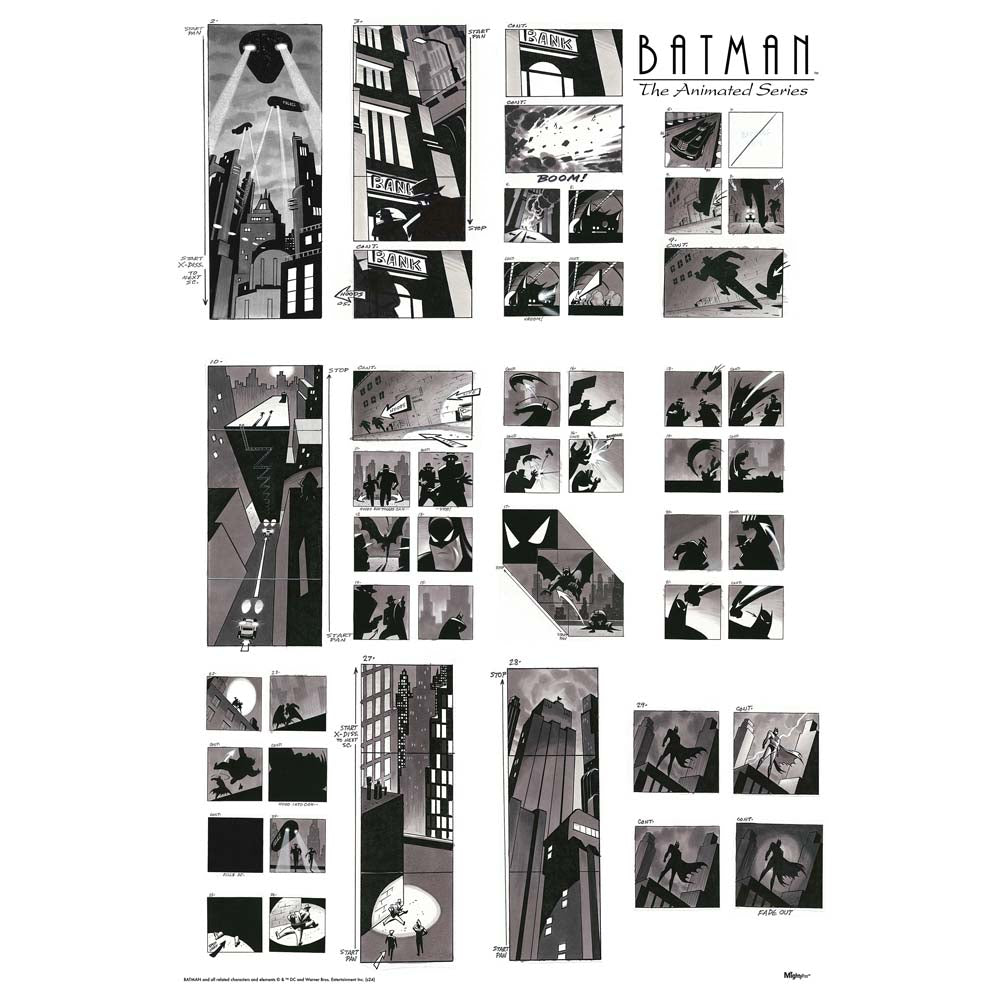
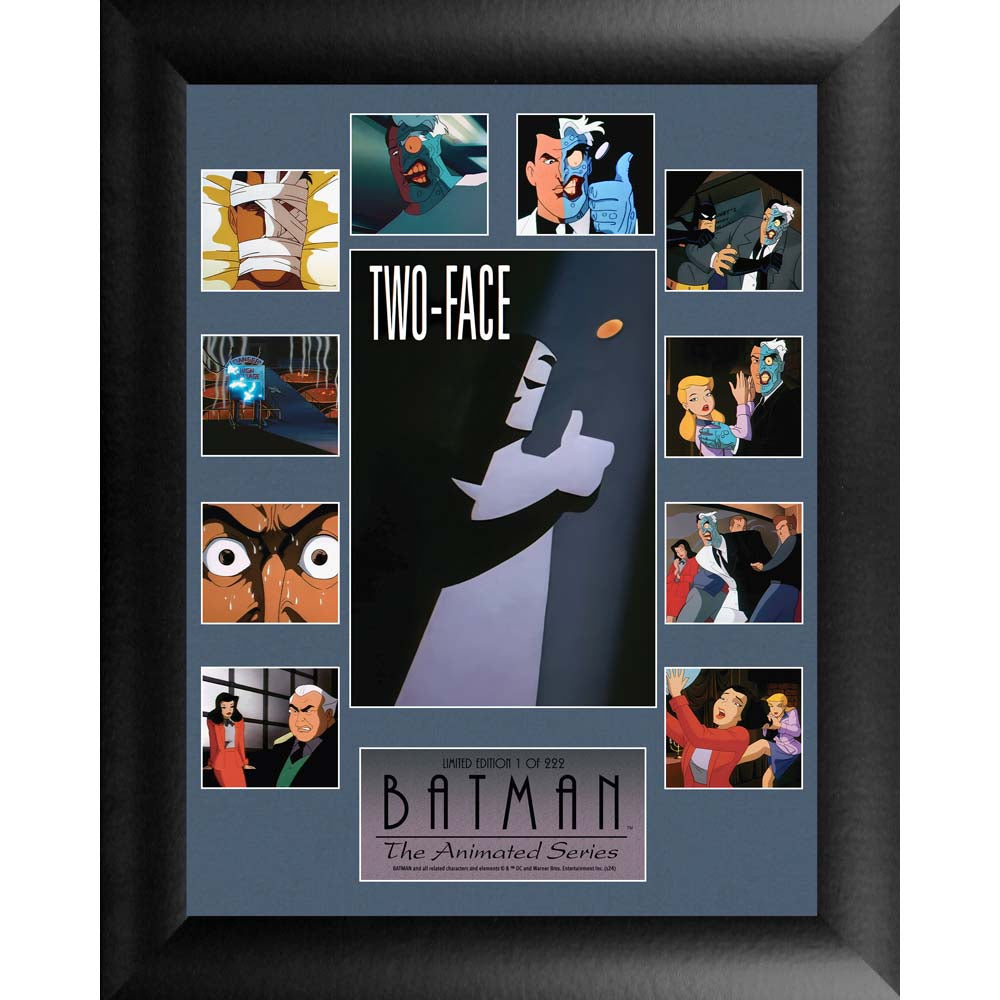
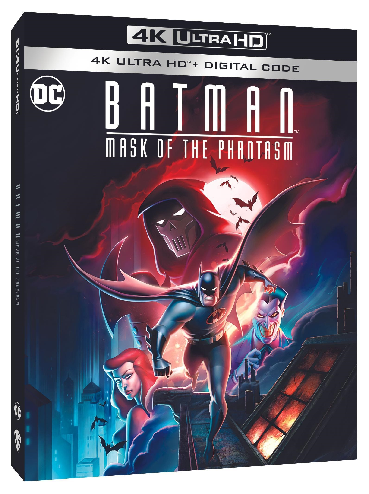
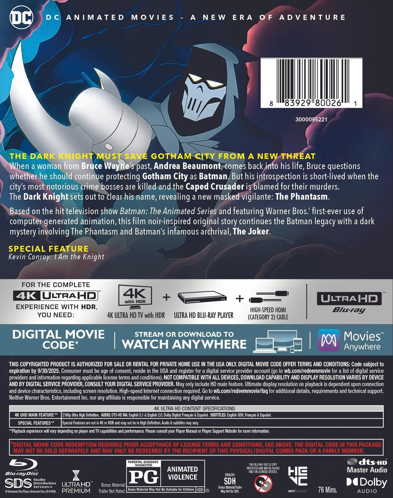
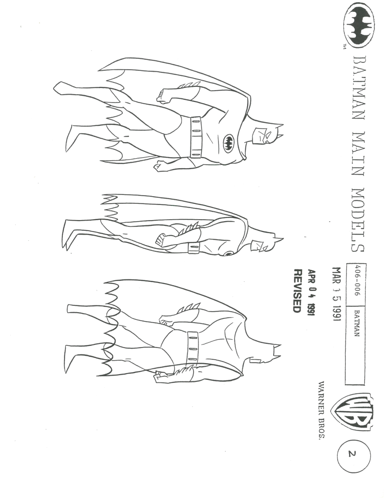
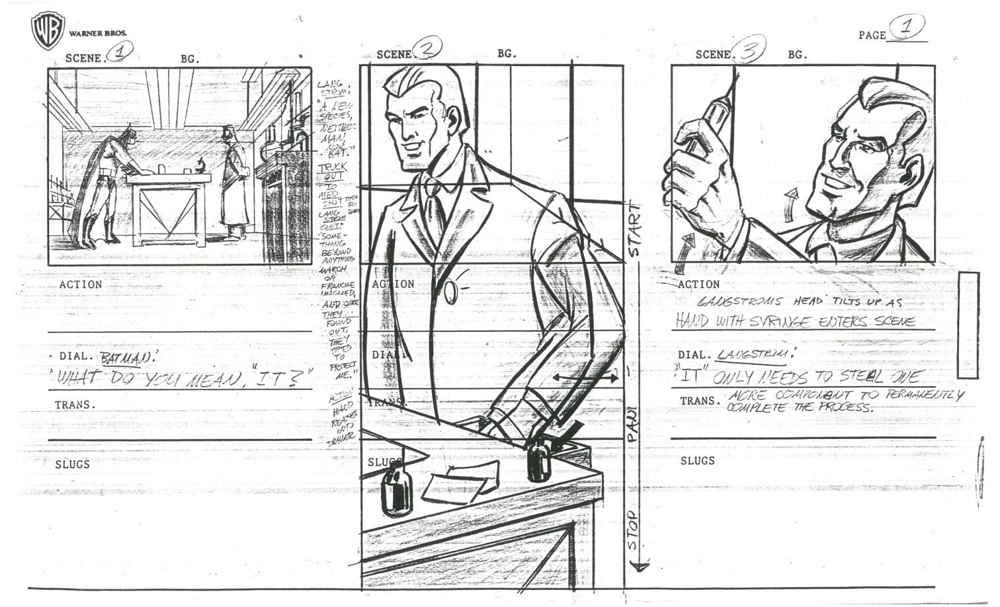

# TAS制作、角色声音与《幽灵的面具》资料补充

核查日期：2026-10-02。13条新来源＋1条既有来源回用；14项制作／研究材料、15条角色配音记录、1部电影及1个修复版本、4篇注释、6张实际图片。

扫描文件已解码：角色模型41页、On Leather Wings分镜文件6页；这里只入库各1页节选，不上传整份PDF，不称完整制作原档。资料包尚未生成网页，站点仍30页／115搜索记录／41来源／24图库图。

## 制作与未制作材料

### Batman Main Models：蝙蝠侠三视图

制作设定扫描。选取PDF第3页，纸面圈号2，编号406-006 BATMAN；印有MAR 15 1991与APR 04 1991 REVISED。保留扫描方向、标记和徽标；前者为纸面日期，后者为修订章，不推算整册完成时间。封面另标REVISED 7/3/91。

核查：已核节选；作者签名与原始收藏链未确认

依据：[BTAS Models扫描合集](https://dcanimated.com/WF/batman/btas/backstage/unproduced/02%20BTAS%20Models.pdf)、[The World’s Finest：主创提供的剧本、未制作故事与制作资料索引](https://dcanimated.com/btas/btas-backstage/btas-backstage-unproduced/)

### On Leather Wings：实验室段落分镜

制作分镜扫描。本文件共6页，节选PDF第2页：纸面PAGE圈号1、SCENE 1–3，画面为蝙蝠侠与Langstrom实验室段落。文件首张却写page 18，不能把文件页序当成完整故事板页序。

核查：已核节选；没有与成片逐镜对齐，不称完整集分镜

依据：[On Leather Wings Storyboard 01扫描](https://dcanimated.com/WF/batman/btas/backstage/unproduced/25%20BTAS%20On%20Leather%20Wings%20Storyboard%2001.pdf)、[The World’s Finest：主创提供的剧本、未制作故事与制作资料索引](https://dcanimated.com/btas/btas-backstage/btas-backstage-unproduced/)

### 片头分镜展示图

商业复制品。商品将画稿归于Bruce Timm／1992；图中展示片头布局，可用于片头构图研究。商品型号MP17240993。

核查：已取得商品图，不是制作原件扫描；年代与作者依据商品说明

依据：[DC Shop：片头分镜商业复制品](https://shop.dc.com/products/batman-the-animated-series-title-sequence-storyboard-mightyprint-wall-art)

### Two-Face标题卡与双集画面组合

商业复制品。官方说明组合两集剧照与中心标题卡，型号WAF0002。可作为标题卡风格入口。

核查：已取得完整商品图；不等同单独原始标题卡或赛璐珞原件

依据：[DC Shop：Two-Face标题卡组合装饰画](https://shop.dc.com/products/batman-the-animated-series-two-face-framed-wall-art)

### 编剧指南目录

制作规范入口。现行入口是分页面图片目录，标签有重复与缺号；旧下载PDF仅有迁移提示。

核查：只完成入口编目，未确认完整页数、作者分工及逐页文字

依据：[BTAS Writing Bible现行图片目录](https://dcanimated.com/btas/batman-the-animated-series-btas-writing-bible/)

### The Midnight Hour

未制作故事。Reaves回忆：第二季阶段写作，借鉴其1987年Teen Titans Spotlight #14的Nightwing故事；因已有足够蝙蝠侠／罗宾矛盾而取消。

核查：主创回忆，未读取全部原稿；不并入85集目录或DCAU事件线

依据：[The World’s Finest：主创提供的剧本、未制作故事与制作资料索引](https://dcanimated.com/btas/btas-backstage/btas-backstage-unproduced/)

### Mind Games

未制作故事。Reaves回忆与Len Wein共同构思，为The Strange Secret of Bruce Wayne的后续想法，涉及失忆的Bruce与Dick；未制作。

核查：主创回忆，未读取全部原稿；不并入85集目录或DCAU事件线

依据：[The World’s Finest：主创提供的剧本、未制作故事与制作资料索引](https://dcanimated.com/btas/btas-backstage/btas-backstage-unproduced/)

### Vigil

未制作故事。Reaves称与Pasko于1993年5月发展构想，未到剧本阶段；他已不记得停止原因，对电视网顾虑的解释属于猜测。

核查：主创回忆，未读取全部原稿；不并入85集目录或DCAU事件线

依据：[The World’s Finest：主创提供的剧本、未制作故事与制作资料索引](https://dcanimated.com/btas/btas-backstage/btas-backstage-unproduced/)

### Masks

剧本／大纲目录。索引列大纲、不完整终稿与多份扫描；仅记录题名，不以草稿代替电影最终剧本。

核查：目录已核；正文与最终版本待核

依据：[The World’s Finest：主创提供的剧本、未制作故事与制作资料索引](https://dcanimated.com/btas/btas-backstage/btas-backstage-unproduced/)

### Feat of Clay Part 1

剧本／大纲目录。索引提供大纲入口；不据此推定最终画面、配音或原稿完整性。

核查：目录已核；正文与最终版本待核

依据：[The World’s Finest：主创提供的剧本、未制作故事与制作资料索引](https://dcanimated.com/btas/btas-backstage/btas-backstage-unproduced/)

### See No Evil

剧本／大纲目录。索引列beat outline、一稿与二稿，可以建立版本比较；尚未读取具体改写。

核查：目录已核；正文与最终版本待核

依据：[The World’s Finest：主创提供的剧本、未制作故事与制作资料索引](https://dcanimated.com/btas/btas-backstage/btas-backstage-unproduced/)

### Off Balance／The Terrible Trio

剧本／大纲目录。索引列剧本与大纲入口；后续需逐页读稿与成片比较。

核查：目录已核；正文与最终版本待核

依据：[The World’s Finest：主创提供的剧本、未制作故事与制作资料索引](https://dcanimated.com/btas/btas-backstage/btas-backstage-unproduced/)

### Modern Masters Volume 3: Bruce Timm

访谈书目。编者Eric Nolen-Weathington；120页，ISBN 9781893905306。公开样章PDF第13页讨论Baby-Doll与心理设计，第15页回忆Trial一度作为长片想法，但认为不足以撑足长片；Timm对Phantasm构思时间的说法含推测。

核查：书目与部分公开访谈已读；非全书研究，出版日期待核

依据：[TwoMorrows：Modern Masters Volume 3 Bruce Timm](https://twomorrows.com/index.php?cPath=70&main_page=product_info&products_id=250)、[Modern Masters Volume 3出版方公开样章](https://www.twomorrows.com/media/MMV3TimmPreview.pdf)

### BTAS→TNBA角色造型比较

比较入口。独立保存后续系列造型比较入口；可以研究轮廓、色块、服装，不把差异自动解释成剧情内换装或某位画师个人决定。

核查：尚未取得可单独编目的比较图片

依据：[TNBA造型变化比较入口](https://dcanimated.com/tnba/tnba-backstage/tnba-backstage-designchanges/)

## 英语配音基础档案

以华纳合辑公告角色列名为准；逐集片尾尚未核对，不能直接套用到TNBA。

| 角色列名 | 演员列名 |

|---|---|

| Batman | Kevin Conroy |

| Alfred | Efrem Zimbalist Jr. |

| Commissioner Gordon | Robert Hastings |

| Robin | Loren Lester |

| Harvey Bullock | Robert Costanzo |

| Joker | Mark Hamill |

| Harvey Dent | Richard Moll |

| Catwoman | Adrienne Barbeau |

| Harley Quinn | Arleen Sorkin |

| Penguin | Paul Williams |

| Barbara Gordon | Melissa Gilbert |

| Clayface | Ron Perlman |

| Dr. Victor Fries | Michael Ansara |

| Ra’s al Ghul | David Warner |

| Edward Nygma | John Glover |

依据：[Warner Bros. · BTAS 全集蓝光历史公告（WF转载）](https://dcanimated.com/btas/btas-releases/btas-releases-blu/btas-blu-complete-series/btas-blu-complete-press-release/)

## 《幽灵的面具》与2023修复版

1993-12-25院线上映；导演Eric Radomski／Bruce Timm，故事Alan Burnett，剧本Alan Burnett／Paul Dini／Martin Pasko／Michael Reaves。2023公告版时长76分钟，不能据此核定所有地区历史版本时长。主配音Kevin Conroy、Dana Delany、Mark Hamill。

依据：[DC：Mask of the Phantasm (1993)](https://www.dc.com/movies/batman-mask-of-the-phantasm-1993)、[华纳2023-07-26《幽灵的面具》4K公告（Screen-Connections转载）](https://screen-connections.com/2023/07/26/batman-mask-of-the-phantasm-4k-uhd-release-details/)

2023-07-26公告计划于2023-09-12发行4K版，画幅1.85:1；公告称扫描1993原始剪辑摄影底片。附录包括康罗伊纪念短片及一集JLU，未观看附录，公告未列该集名称。

依据：[华纳2023-07-26《幽灵的面具》4K公告（Screen-Connections转载）](https://screen-connections.com/2023/07/26/batman-mask-of-the-phantasm-4k-uhd-release-details/)

### 电影创作：起源与爱情

Burnett回忆希望以爱情故事从另一角度探索蝙蝠侠起源；先写详细treatment与剧本前40页，Pasko接墓地段落，Dini承担小丑引入。此口述并非完整四位编剧逐场分工表。

核查：主创回忆；本文不揭示面具人物身份

依据：[Alan Burnett：Phantasm十五周年访谈](https://dcanimated.com/btas/mask-of-the-phantasm/motpanniv-backstage/motpanniv-backstage-burnett/)

### PG尺度与院线决定

Burnett回忆为PG尺度间接处理暴力；他将院线决定与Radomski的电脑制作片头联系起来，但以“据我所知”表述。访谈用DVD谈1993阶段，不能据此认定1993年已有DVD发行。

核查：口述历史；管理层决定与历史载体需另核

依据：[Alan Burnett：Phantasm十五周年访谈](https://dcanimated.com/btas/mask-of-the-phantasm/motpanniv-backstage/motpanniv-backstage-burnett/)

### 回顾文章与版本时间

2014年DC回顾中的“尚无蓝光”属于当时状态；2023年华纳已宣布4K版。原片上映与修复版发行分开，包装图片只标2023版，不冒充1993海报。

核查：历史时间层次已区分

依据：[DC／Tim Beedle：Batman’s Feature-Length Phantasm，2014-02-19](https://www.dc.com/blog/2014/02/19/batmans-feature-length-phantasm)、[华纳2023-07-26《幽灵的面具》4K公告（Screen-Connections转载）](https://screen-connections.com/2023/07/26/batman-mask-of-the-phantasm-4k-uhd-release-details/)

### 角色声音与配音导演

15条演员记录取自合辑新闻稿，不替代逐集片尾。公告另列Andrea Romano为casting/dialogue director；Barbara与Robin的配音不能直接套用到TNBA。

核查：作品层面确认；逐集确认待补

依据：[Warner Bros. · BTAS 全集蓝光历史公告（WF转载）](https://dcanimated.com/btas/btas-releases/btas-releases-blu/btas-blu-complete-series/btas-blu-complete-press-release/)

## 图片档案

均已实际保存、解码、目视核查；尺寸为原图实际尺寸。商业复制品、制作扫描与发行包装分别登记，不冒充制作原件或1993海报。

### 片头分镜商业复制品

类型：商品宣传图；1000×1000。

依据：[DC Shop：片头分镜商业复制品](https://shop.dc.com/products/batman-the-animated-series-title-sequence-storyboard-mightyprint-wall-art)

[原图／扫描出处](https://shop.dc.com/cdn/shop/files/MP17240993_fc6cd7e5-b770-480d-a266-43425a1fb444.jpg?v=1738598531&width=1946)；Batman及相关形象：DC／Warner Bros.；商品复制品由Trend Setters提供。公开可见不等于开放授权；保存原标记，不去水印。

### Two-Face标题卡组合装饰画

类型：商品宣传图；1000×1000。

依据：[DC Shop：Two-Face标题卡组合装饰画](https://shop.dc.com/products/batman-the-animated-series-two-face-framed-wall-art)

[原图／扫描出处](https://cdn.shopify.com/s/files/1/0268/8129/4530/files/WAF0002_frame_3ec3d749-fe8d-4029-8dfb-62972eaaff73.jpg?v=1738599159)；Batman及相关形象：DC／Warner Bros.；商品复制品由Trend Setters提供。公开可见不等于开放授权；保存原标记，不去水印。

### 2023《幽灵的面具》4K版正面包装

类型：发行包装图；1593×2131。

依据：[华纳2023-07-26《幽灵的面具》4K公告（Screen-Connections转载）](https://screen-connections.com/2023/07/26/batman-mask-of-the-phantasm-4k-uhd-release-details/)

[原图／扫描出处](https://i0.wp.com/screen-connections.com/wp-content/uploads/2023/07/Batman.Mask_.Of_.The_.Phantasm-4K.Ultra_.HD_.Cover_.jpg?fit=1593%2C2131&ssl=1)；Batman及相关形象：DC／Warner Bros.；商品复制品由Trend Setters提供。公开可见不等于开放授权；保存原标记，不去水印。

### 2023《幽灵的面具》4K版背面包装

类型：发行包装图；1186×1500。

依据：[华纳2023-07-26《幽灵的面具》4K公告（Screen-Connections转载）](https://screen-connections.com/2023/07/26/batman-mask-of-the-phantasm-4k-uhd-release-details/)

[原图／扫描出处](https://i0.wp.com/screen-connections.com/wp-content/uploads/2023/07/Batman.Mask_.Of_.The_.Phantasm-4K.Ultra_.HD_.Cover-Back.jpg?fit=1186%2C1500&ssl=1)；Batman及相关形象：DC／Warner Bros.；商品复制品由Trend Setters提供。公开可见不等于开放授权；保存原标记，不去水印。

### Batman模型扫描：PDF第3页／纸面圈号2

类型：制作设定扫描节选；918×1188。

依据：[BTAS Models扫描合集](https://dcanimated.com/WF/batman/btas/backstage/unproduced/02%20BTAS%20Models.pdf)

[原图／扫描出处](https://dcanimated.com/WF/batman/btas/backstage/unproduced/02%20BTAS%20Models.pdf)；Batman及相关形象：DC／Warner Bros.；商品复制品由Trend Setters提供。公开可见不等于开放授权；保存原标记，不去水印。

### On Leather Wings：PDF第2页／纸面PAGE 1

类型：制作分镜扫描节选；1512×918。

依据：[On Leather Wings Storyboard 01扫描](https://dcanimated.com/WF/batman/btas/backstage/unproduced/25%20BTAS%20On%20Leather%20Wings%20Storyboard%2001.pdf)

[原图／扫描出处](https://dcanimated.com/WF/batman/btas/backstage/unproduced/25%20BTAS%20On%20Leather%20Wings%20Storyboard%2001.pdf)；Batman及相关形象：DC／Warner Bros.；商品复制品由Trend Setters提供。公开可见不等于开放授权；保存原标记，不去水印。

## 下一轮缺口

- 109集片尾、制作代码和地区首播未逐项核对

- 编剧指南与剧本只完成目录编目，未全文研究

- 扫描节选尚未与成片镜头对齐；原始收藏链未确认

- 1993原始海报、电影改编漫画内页、各集原始标题卡待补

- 披风斗士保持独立连续性，现代延续是编辑比较角度

## 来源核查记录

- [DC Shop：片头分镜商业复制品](https://shop.dc.com/products/batman-the-animated-series-title-sequence-storyboard-mightyprint-wall-art)：官方商品说明与图片；正文已读

- [DC Shop：Two-Face标题卡组合装饰画](https://shop.dc.com/products/batman-the-animated-series-two-face-framed-wall-art)：官方商品说明与图片；正文已读

- [The World’s Finest：主创提供的剧本、未制作故事与制作资料索引](https://dcanimated.com/btas/btas-backstage/btas-backstage-unproduced/)：档案站来源声明；附Michael Reaves本人回忆；正文已读

- [BTAS Models扫描合集](https://dcanimated.com/WF/batman/btas/backstage/unproduced/02%20BTAS%20Models.pdf)：由上述档案索引链接的制作资料扫描；下载完成、PDF解码41页；查看封面及前12页，不表示全册逐项核查

- [On Leather Wings Storyboard 01扫描](https://dcanimated.com/WF/batman/btas/backstage/unproduced/25%20BTAS%20On%20Leather%20Wings%20Storyboard%2001.pdf)：由上述档案索引链接的分镜扫描；下载完成、PDF解码6页，六页概览及节选目视核查

- [BTAS Writing Bible现行图片目录](https://dcanimated.com/btas/batman-the-animated-series-btas-writing-bible/)：档案站图像目录；目录已读；未全文读取，旧PDF为迁移通知，不是指南正文

- [TNBA造型变化比较入口](https://dcanimated.com/tnba/tnba-backstage/tnba-backstage-designchanges/)：档案站比较索引；入口已确认，尚未逐图研究

- [TwoMorrows：Modern Masters Volume 3 Bruce Timm](https://twomorrows.com/index.php?cPath=70&main_page=product_info&products_id=250)：出版方书目；正文已读

- [Modern Masters Volume 3出版方公开样章](https://www.twomorrows.com/media/MMV3TimmPreview.pdf)：出版方公开主创访谈样章；网页解析30页；部分访谈已读，本地下载406，未取得完整书籍

- [DC：Mask of the Phantasm (1993)](https://www.dc.com/movies/batman-mask-of-the-phantasm-1993)：官方电影条目；官方搜索摘要可读，直接访问403

- [DC／Tim Beedle：Batman’s Feature-Length Phantasm，2014-02-19](https://www.dc.com/blog/2014/02/19/batmans-feature-length-phantasm)：官方历史回顾；浏览器正文已读；发行状态只代表2014年

- [Alan Burnett：Phantasm十五周年访谈](https://dcanimated.com/btas/mask-of-the-phantasm/motpanniv-backstage/motpanniv-backstage-burnett/)：编剧本人访谈；正文已读

- [华纳2023-07-26《幽灵的面具》4K公告（Screen-Connections转载）](https://screen-connections.com/2023/07/26/batman-mask-of-the-phantasm-4k-uhd-release-details/)：华纳发行新闻稿的媒体转载与包装图；正文已读

- [Warner Bros. · BTAS 全集蓝光历史公告（WF转载）](https://dcanimated.com/btas/btas-releases/btas-releases-blu/btas-blu-complete-series/btas-blu-complete-press-release/)：华纳历史公告；本轮正文读取确认；既有来源回用
