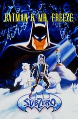
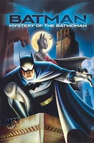
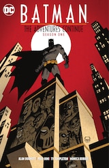
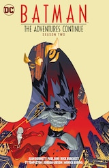
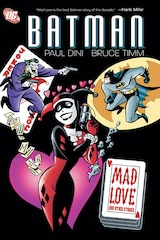
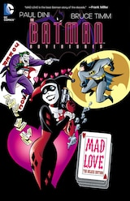
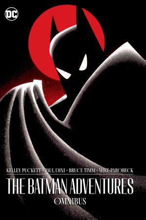

# TAS资料站 · 制作、声音与出版资料补充

核查日期：2026-10-02。按资料站定位编目；事实、主创回忆与本站比较方向分别标明。

本批13条新来源＋5条既有来源回用，11项作品／版本记录、7篇档案注释、7组配乐署名与8张实际图片。BTAS85／TNBA24集沿用既有目录，未增加逐集深档。

## 作品与版本书目

### Batman: The Animated Series

类型：电视动画。关系：专题主体。

元数据：{"officialYears": "1992–1995", "catalogEpisodes": 85, "executiveProducers": ["Jean MacCurdy", "Tom Ruegger"], "producers": ["Alan Burnett", "Eric Radomski", "Bruce Timm"]}

依据：[DC：BTAS系列主创](https://www.dc.com/tv/batman-the-animated-series-1992-1995)、[The World’s Finest · Episode Guide 01–30](https://dcanimated.com/btas/btas-guides/btas-episode-guide-01-30/)

待核：85条既有目录不等于85篇深档；制作代码、地区首播与版本顺序待片尾／发行材料核对。

### The New Batman Adventures

类型：电视动画。关系：BTAS后续系列，独立编目。

元数据：{"catalogEpisodes": 24, "combinedBluRayTVEpisodes": 109}

依据：[The World’s Finest · TNBA 24集指南](https://dcanimated.com/tnba/tnba-guides/tnba-guides-episode-guide-01-26/)、[Warner Bros. · BTAS 全集蓝光历史公告（WF转载）](https://dcanimated.com/btas/btas-releases/btas-releases-blu/btas-blu-complete-series/btas-blu-complete-press-release/)

待核：109是合辑电视集数85+24，不把随附电影计算为剧集。逐集片尾与造型比较尚待核。

### Batman & Mr. Freeze: SubZero

类型：动画电影。关系：TAS关联长片。

元数据：{"year": 1998, "director": "Boyd Kirkland", "writersAsListedByDC": ["Boyd Kirkland", "Randy Rogel", "Bob Kane"], "cast": ["Kevin Conroy", "Michael Ansara", "Loren Lester", "Efrem Zimbalist Jr."]}

依据：[DC：Batman & Mr. Freeze: SubZero (1998)](https://www.dc.com/movies/batman-and-mr-freeze-sub-zero-1998)

待核：DC列名未区分原著角色与具体剧本署名；精确日期、时长及完整片尾仍待核。

### Batman: Mystery of the Batwoman

类型：动画电影。关系：关联动画电影；不并入85/24集。

元数据：{"year": 2003, "director": "Curt Geda", "writers": ["Michael Reaves", "Alan Burnett"], "cast": ["Kevin Conroy", "Hector Elizondo", "Kyra Sedgwick", "Kelly Ripa"]}

依据：[DC：Mystery of the Batwoman (2003)](https://www.dc.com/movies/batman-mystery-of-the-batwoman-2003)

待核：不依据片名推定Batwoman是Kate Kane；角色身份与完整配音对应待片尾核对。

### Batman Adventures: Mad Love Deluxe Edition

类型：漫画再版。关系：独立版本书目。

元数据：{"editionOnSale": "2015-04-15", "pages": 96, "writers": ["Paul Dini", "Bruce Timm"], "artist": "Bruce Timm"}

依据：[DC：Mad Love Deluxe Edition，2015版](https://www.dc.com/graphic-novels/batman-adventures-1992/batman-adventures-mad-love-deluxe-edition)

待核：日期是本版上架日，不是原始Mad Love故事首发日；原刊版权页尚未读取。

### Batman: Mad Love and Other Stories

类型：漫画合集。关系：Mad Love与其他短篇合辑。

元数据：{"editionOnSale": "2011-08-31", "pages": 208, "otherContents": ["Batman Adventures Annual #1–2", "Batman Adventures Holiday Special", "Adventures in the DC Universe #3", "Batman Black and White #1"]}

依据：[DC：Mad Love and Other Stories，2011平装](https://www.dc.com/graphic-novels/batman-adventures-1992/batman-mad-love-and-other-stories)

待核：合集多位画师署名不自动套用到Mad Love单篇；逐篇署名及页码待内页核对。

### Batman: The Adventures Continue Season One

类型：漫画合集。关系：由动画主创扩展其世界的新漫画故事。

元数据：{"editionOnSale": "2021-06-01", "pages": 208, "collects": "Batman: The Adventures Continue #1–8", "announcementWriters": ["Paul Dini", "Alan Burnett"], "announcementArtist": "Ty Templeton", "originalPlanIssues": 6}

依据：[DC：Adventures Continue Season One合集](https://www.dc.com/graphic-novels/batman-the-adventures-continue-season-one)、[DC：Adventures Continue，2020发布公告](https://www.dc.com/blog/2020/02/13/batman-the-adventures-continue-arrives-from-paul-dini-alan-burnett-and-ty-templeton)

待核：公告六期与最终收八期分开记录；不等于新电视季，不以纸本期号推算数字章节数。

### Batman: The Adventures Continue Season Two

类型：漫画合集。关系：上一漫画项目的后续合集。

元数据：{"editionOnSale": "2022-06-14", "pages": 192, "collects": "Season Two #1–7及’Tis the Season to Be Freezin’ #1短篇", "writers": ["Alan Burnett", "Paul Dini"], "artistsAsCollected": ["Ty Templeton", "Rick Burchett", "Jordan Gibson"]}

依据：[DC：Adventures Continue Season Two合集](https://www.dc.com/graphic-novels/batman-the-adventures-continue-season-two)

待核：合集画师列表不等于每期逐一署名。标题Season Two是漫画项目，不是电视动画季号。

### The Batman Adventures Omnibus

类型：漫画合集。关系：动画衍生漫画版本书目。

元数据：{"isbn": "9781779521194", "editionOnSale": "2023-09-05", "pages": 1192, "creditedAuthor": "Kelley Puckett", "creditedIllustrators": ["Michael Parobeck", "Ty Templeton"], "publisherCollection": "#1–36、Annual #1–2、Holiday Special #1、Mad Love #1，以及Batman: Black & White Omnibus故事"}

依据：[Penguin Random House：The Batman Adventures Omnibus](https://www.penguinrandomhouse.com/books/735666/the-batman-adventures-omnibus-by-kelley-puckett/)

待核：发行商简介涉及企鹅市长等情节，疑似混入另一漫画系列，暂不采用；电影改编是否收录需目录／版权页核对。

### Batman: The Animated Series Vol. 2

类型：配乐唱片。关系：声音档案与署名核查材料。

元数据：{"sku": "LLLCD1218", "discs": 4, "historicalEditionUnits": 3500, "linerNotesPages": 36, "linerNotesWriter": "John Takis", "producer": "MV Gerhard", "mastering": "James Nelson"}

依据：[La-La Land Records：BTAS Vol. 2唱片与分集署名](https://lalalandrecords.com/batman-the-animated-series-vol-2-limited-edition/)

待核：只记录厂牌公开元数据，不复制整份曲目或册子；无音频文件，不表示当前库存或购买建议。

### Batman: Caped Crusader

类型：电视动画。关系：本站策划的TAS现代延续尝试／审美比较。

元数据：{"approach": "Bruce Timm参与、1940年代背景与黑色电影视角"}

依据：[DC：披风斗士的创作与角色重释](https://www.dc.com/blog/2024/08/02/batman-caped-crusader-builds-on-all-that-s-come-before)

待核：现代延续是专题编辑视角，不作为DCAU同一连续性或BTAS剧情续集确认。两季目录沿用既有资料。

## 档案注释

### 从暗处塑造哥谭

Radomski将从暗处以光色引出形象的思路联系到Monet、Bernie Fuchs、Coppola与Fleischer动画；他解释这也能用有限细节维持气氛与制作一致性。资料站可比较背景、标题卡与人物剪影，但不能把所有片尾美术岗位归给他。

依据：[Eric Radomski本人访谈／Jim Harvey，2012年9月](https://dcanimated.com/btas/btas-backstage/btas-backstage-interviews/btas-interview-eric-radomski/)

核查状态：主创口述摘述；具体画稿待补

### 试片到系列：共同制作的证据

Radomski回忆与Timm制作90秒试片后获任制片，首批目标65集；Alan Burnett加入带来经验与合作。他回忆最多七家工作室在四国同时工作，主体为传统手工二维与胶片拍摄。这里记录受访者回忆，不据此推导每集外包工作室。

依据：[Eric Radomski本人访谈／Jim Harvey，2012年9月](https://dcanimated.com/btas/btas-backstage/btas-backstage-interviews/btas-interview-eric-radomski/)、[DC：BTAS系列主创](https://www.dc.com/tv/batman-the-animated-series-1992-1995)

核查状态：制作史入口；原始试片未取得

### 哈莉：从动画走向漫画

DC回顾将哈莉的动画登场定位在1992年Joker’s Favor，归于Dini与Timm创作，并指出Arleen Sorkin的声音与Timm造型。文章区分The Batman Adventures #12的早期漫画登场和Batman: Harley Quinn #1进入主连续性。角色相同不表示这些作品处于同一个宇宙。

依据：[DC／Rosie Knight：Harley Quinn Comes Into her Own](https://www.dc.com/blog/2019/05/22/brilliant-women-of-batman-harley-quinn-comes-into-her-own)

核查状态：官方回顾；原刊与片尾未逐项核验

### 声音表演需要独立档案

沿用康罗伊本人访谈，整理布鲁斯／蝙蝠侠表演、共同录音与代表篇目作为声音专题入口。配音演员、角色、系列、语种、版本和片尾证据分别存储；其他语言配音不套用英语演员表。

依据：[DC · Behind the Bat: An Interview with Kevin Conroy](https://www.dc.com/blog/2014/02/21/behind-the-bat-an-interview-with-kevin-conroy)

核查状态：已有主档案回用；完整演员表待补

### 艾美奖记录的范围

Television Academy在Batman: The Series条目下列1993年Outstanding Animated Program (For Programming One Hour Or Less)获奖。该页未标出具体获奖集，不单凭此页写成Robin’s Reckoning获奖；该记录也不是所有日间艾美奖的总表。

依据：[Television Academy：Batman: The Series](https://www.televisionacademy.com/shows/batman-series)

核查状态：机构记录已核；分集与其他奖项待核

### Mad Love：故事与版本不能合并

TNBA目录里的Mad Love、原始漫画故事与2011／2015再版分别编目。可做漫画到动画的改编比较，但本批仅取得书目和版本封面，未完成漫画内页与动画镜头对照。

依据：[DC：Mad Love Deluxe Edition，2015版](https://www.dc.com/graphic-novels/batman-adventures-1992/batman-adventures-mad-love-deluxe-edition)、[DC：Mad Love and Other Stories，2011平装](https://www.dc.com/graphic-novels/batman-adventures-1992/batman-mad-love-and-other-stories)、[The World’s Finest · TNBA 24集指南](https://dcanimated.com/tnba/tnba-guides/tnba-guides-episode-guide-01-26/)

核查状态：比较框架；内页与镜头证据待补

### 两种延续：漫画与新动画

Adventures Continue由原动画主创拓展既有动画世界，其Season One／Two是漫画命名。Caped Crusader另列现代审美延续尝试；可比较年代氛围、设计和人物重写，不建立与DCAU的剧情接续年表。

依据：[DC：Adventures Continue，2020发布公告](https://www.dc.com/blog/2020/02/13/batman-the-adventures-continue-arrives-from-paul-dini-alan-burnett-and-ty-templeton)、[DC：Adventures Continue Season One合集](https://www.dc.com/graphic-novels/batman-the-adventures-continue-season-one)、[DC：Adventures Continue Season Two合集](https://www.dc.com/graphic-novels/batman-the-adventures-continue-season-two)、[DC：披风斗士的创作与角色重释](https://www.dc.com/blog/2024/08/02/batman-caped-crusader-builds-on-all-that-s-come-before)

核查状态：关系已区分；不做统一宇宙推断

## 配乐署名核查

下表只记录唱片曲目分组署名；主题曲、每集配乐和音乐监督不能互相替代。Heart of Ice保留Todd Hayen与Shirley Walker共同列名，不把分组署名直接扩张为逐段分工。

| 分组／篇目 | 厂牌列名 |

|---|---|

| Main Title | Danny Elfman |

| Beware the Gray Ghost | Carl Swander Johnson |

| The Cat and the Claw Part I | Harvey R. Cohen, Wayne Coster, Shirley Walker |

| The Cat and the Claw Part II | Harvey R. Cohen |

| Nothing to Fear | Shirley Walker |

| Heart of Ice | Todd Hayen, Shirley Walker |

| Appointment in Crime Alley | Stuart Balcomb |

依据：[La-La Land Records：BTAS Vol. 2唱片与分集署名](https://lalalandrecords.com/batman-the-animated-series-vol-2-limited-edition/)

## 已保存图片

以下为研究图，尚未接入网页图库；缩略图不放大为主视觉。官网发布不等于开放授权，保留归属与原图地址。

### 哈莉与小丑的动画画面／DC文章配图；该页未指明分集，不标为Joker’s Favor截图

实际尺寸：900 × 682。依据：[DC／Rosie Knight：Harley Quinn Comes Into her Own](https://www.dc.com/blog/2019/05/22/brilliant-women-of-batman-harley-quinn-comes-into-her-own)

[原图](https://static.dc.com/sites/default/files/imce/2019/05-MAY/fullres-harade10_5ce44265bdd845.58542102.jpg)；SHA-256：`5aa565ab00e15d0a03d08ecd3c1e7568e3343d7c5d3ebe73cb54331790fab3ff`。

### SubZero电影封面缩略图

实际尺寸：160 × 243。依据：[DC：Batman & Mr. Freeze: SubZero (1998)](https://www.dc.com/movies/batman-and-mr-freeze-sub-zero-1998)

[原图](https://static.dc.com/dc/files/default_images/batmanandmrfreeze_thumb_192x291_52ac0c1cb55ac7.72468344.jpg?w=160)；SHA-256：`e2b8b7b0b15eb08a21b3ae2c54166aeb862148a27b598ced1817e88e926533b5`。

### Mystery of the Batwoman电影封面缩略图

实际尺寸：160 × 243。依据：[DC：Mystery of the Batwoman (2003)](https://www.dc.com/movies/batman-mystery-of-the-batwoman-2003)

[原图](https://static.dc.com/dc/files/default_images/batmanbatwoman_thumb_192x291_52ac1710b7aba3.86797187.jpg?w=160)；SHA-256：`fdabca9818b7cb84b37dfa8a02a2366fd2a639a7e614465d3bc3a28695d15678`。

### Adventures Continue Season One合集封面缩略图

实际尺寸：160 × 246。依据：[DC：Adventures Continue Season One合集](https://www.dc.com/graphic-novels/batman-the-adventures-continue-season-one)

[原图](https://static.dc.com/dc/files/default_images/BTMADVC_S1_CV_60b025792515a6.16294638.jpg?w=160)；SHA-256：`3cdc6da54da0c910a6d2ca763cf9d42265039e6921a569c9610cbd8f80608f4d`。

### Adventures Continue Season Two合集封面缩略图

实际尺寸：160 × 246。依据：[DC：Adventures Continue Season Two合集](https://www.dc.com/graphic-novels/batman-the-adventures-continue-season-two)

[原图](https://static.dc.com/dc/files/default_images/BMTACS2%2520%2528Cover%2529_629120acaab344.82682916.jpg?w=160)；SHA-256：`bb09a9f60f5f5588d36eb5ce4cfea4f76946dde0158199ca5edbefb20044baa0`。

### Mad Love and Other Stories封面缩略图

实际尺寸：160 × 240。依据：[DC：Mad Love and Other Stories，2011平装](https://www.dc.com/graphic-novels/batman-adventures-1992/batman-mad-love-and-other-stories)

[原图](https://static.dc.com/dc/files/default_images/19055_400x600.jpg?w=160)；SHA-256：`2d893959bc298eb09ba0df5f1b5b481ee4326ab91da75e97417d0823031e2b8f`。

### Mad Love Deluxe封面缩略图；图由DC同系列推荐区取得，封面年份未据图片推定

实际尺寸：160 × 248。依据：[DC：Mad Love Deluxe Edition，2015版](https://www.dc.com/graphic-novels/batman-adventures-1992/batman-adventures-mad-love-deluxe-edition)

[原图](https://static.dc.com/dc/files/default_images/bm_dlx_madlove_deluxe_5b035c91edcd70.55282279.jpg?w=160)；SHA-256：`015ad3d6be81a147441be93df49c1c77817c6eac6c9dc201e80015a0fd6f5f19`。

### The Batman Adventures Omnibus出版社封面

实际尺寸：298 × 450。依据：[Penguin Random House：The Batman Adventures Omnibus](https://www.penguinrandomhouse.com/books/735666/the-batman-adventures-omnibus-by-kelley-puckett/)

[原图](https://images3.penguinrandomhouse.com/cover/9781779521194)；SHA-256：`aa299adbc0a28cb5c5bcf443cbf3ba88b1f6e3ae26d8a15e0b856d00bcd7296c`。

## 尚缺材料

- BTAS85集与TNBA24集逐集片尾署名、制作代码、地区首播、发行顺序尚未全核。

- Mask of the Phantasm沿用已有图文入口，本批没有新增该片完整制作档案；其他关联电影亦非已穷尽。

- 标题卡、角色设定、背景稿、分镜及制作文件原件尚缺；主创访谈不能替代原画证据。

- 逐角色造型变化、完整英语及中文配音、作曲分工与其他奖项记录尚缺。

- 漫画只核公开书目和封面，未阅读完整内页；原刊日期、页码和漫画／动画逐镜比较仍为空。

- Batman Animated制作书尚未取得可核官方书目和内页；不收录来源不明的整本PDF。

- 图片为1张动画画面与7张封面，其中6张宽160px；没有逐集截图覆盖，也没有高清设定稿。

## 来源登记

搜索返回与直接读取失败分别记录；未核内容不补写为事实。

- [DC：BTAS系列主创](https://www.dc.com/tv/batman-the-animated-series-1992-1995)：官方公开资料；官方搜索结果可读；直接打开403。

- [Eric Radomski本人访谈／Jim Harvey，2012年9月](https://dcanimated.com/btas/btas-backstage/btas-backstage-interviews/btas-interview-eric-radomski/)：主创口述一手材料，发表于The World’s Finest；公开正文已读取。

- [Television Academy：Batman: The Series](https://www.televisionacademy.com/shows/batman-series)：奖项主办机构记录；公开正文已读取。

- [DC：Batman & Mr. Freeze: SubZero (1998)](https://www.dc.com/movies/batman-and-mr-freeze-sub-zero-1998)：官方公开资料；公开正文已读取。

- [DC：Mystery of the Batwoman (2003)](https://www.dc.com/movies/batman-mystery-of-the-batwoman-2003)：官方公开资料；公开正文已读取。

- [DC／Rosie Knight：Harley Quinn Comes Into her Own](https://www.dc.com/blog/2019/05/22/brilliant-women-of-batman-harley-quinn-comes-into-her-own)：官方公开资料；公开正文已读取。

- [DC：Mad Love Deluxe Edition，2015版](https://www.dc.com/graphic-novels/batman-adventures-1992/batman-adventures-mad-love-deluxe-edition)：官方公开资料；官方搜索结果可读；直接打开403。

- [DC：Mad Love and Other Stories，2011平装](https://www.dc.com/graphic-novels/batman-adventures-1992/batman-mad-love-and-other-stories)：官方公开资料；公开正文已读取。

- [DC：Adventures Continue，2020发布公告](https://www.dc.com/blog/2020/02/13/batman-the-adventures-continue-arrives-from-paul-dini-alan-burnett-and-ty-templeton)：官方公开资料；官方搜索结果可读；直接打开失败；历史计划。

- [DC：Adventures Continue Season One合集](https://www.dc.com/graphic-novels/batman-the-adventures-continue-season-one)：官方公开资料；公开正文已读取。

- [DC：Adventures Continue Season Two合集](https://www.dc.com/graphic-novels/batman-the-adventures-continue-season-two)：官方公开资料；公开正文已读取。

- [Penguin Random House：The Batman Adventures Omnibus](https://www.penguinrandomhouse.com/books/735666/the-batman-adventures-omnibus-by-kelley-puckett/)：官方发行商书目；简介疑似错配，不采用其剧情；公开正文已读取。

- [La-La Land Records：BTAS Vol. 2唱片与分集署名](https://lalalandrecords.com/batman-the-animated-series-vol-2-limited-edition/)：唱片发行厂牌一手曲目表；公开正文已读取。

- [The World’s Finest · Episode Guide 01–30](https://dcanimated.com/btas/btas-guides/btas-episode-guide-01-30/)：既有索引；既有来源回用。 既有来源回用。

- [The World’s Finest · TNBA 24集指南](https://dcanimated.com/tnba/tnba-guides/tnba-guides-episode-guide-01-26/)：既有索引；既有来源回用。 既有来源回用。

- [Warner Bros. · BTAS 全集蓝光历史公告（WF转载）](https://dcanimated.com/btas/btas-releases/btas-releases-blu/btas-blu-complete-series/btas-blu-complete-press-release/)：既有索引；既有来源回用。 既有来源回用。

- [DC · Behind the Bat: An Interview with Kevin Conroy](https://www.dc.com/blog/2014/02/21/behind-the-bat-an-interview-with-kevin-conroy)：既有索引；既有来源回用。 既有来源回用。

- [DC：披风斗士的创作与角色重释](https://www.dc.com/blog/2024/08/02/batman-caped-crusader-builds-on-all-that-s-come-before)：既有索引；既有来源回用。 既有来源回用。

站点状态：独立研究包，未生成新网页；站点仍30页／115搜索记录／41来源／24图库图。
